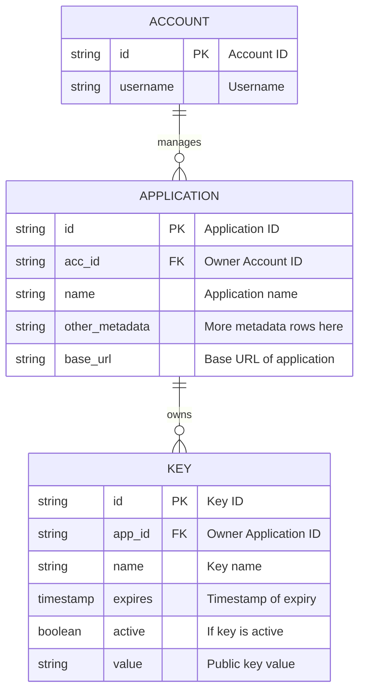

# Requirements
1. Go v1.23.2

# Getting Started
1. Run `go mod download`
2. Run `go install github.com/sqlc-dev/sqlc/cmd/sqlc@latest`

# Database Structure

```mermaid
erDiagram
    ACCOUNT {
        string id PK "Account ID"
        string username "Username"
    }
    
    APPLICATION {
        string id PK "Application ID"
        string acc_id FK "Owner Account ID"
        string name "Application name"
        string other_metadata "More metadata rows here"
        string base_url "Base URL of application"
    }
    
    KEY {
        string id PK "Key ID"
        string app_id FK "Owner Application ID"
        string name "Key name"
        timestamp expires "Timestamp of expiry"
        boolean active "If key is active"
        string value "Public key value"
    }
    
    ACCOUNT ||--o{ APPLICATION : manages
    APPLICATION ||--o{ KEY : owns
```